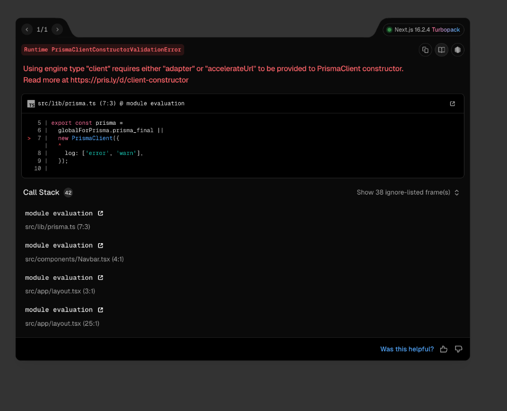

# Lost & Found Management System (LFMS)

A centralized, secure digital platform designed for the SE VLabs Institute to manage lost and found items within the campus ecosystem. This project demonstrates a production-ready implementation of a full-stack web application using modern software engineering principles.



## Core Features

- **Centralized Directory**: Unified search and filtering for lost and found items.
- **Admin Verification**: Mandatory administrator approval for all new posts to ensure platform integrity.
- **Secure Authentication**: Multi-layered security with password hashing and security-question-based recovery.
- **Ownership Verification**: Robust claim submission system where users provide proof of ownership for found items.
- **Admin Portal**: Specialized dashboard for overseeing platform operations, verifying items, and managing claims.

## Software Engineering Concepts Implemented

### 1. Model-View-Controller (MVC) Architecture
The system is architected following the MVC pattern to ensure a clean separation of concerns:
- **Model**: SQLite database schema managed via Prisma for data integrity and normalization.
- **View**: Dynamic, responsive UI built with React Server Components and optimized for high-end aesthetics.
- **Controller**: Next.js API Routes and Server Actions handling the business logic, validation, and database interactions.

### 2. SOLID Principles
- **Single Responsibility**: Each API route and component is dedicated to a single functional unit (e.g., Auth, Item Management, Claim Processing).
- **Interface Segregation**: Clients (Users/Admins) interact with specialized dashboards tailored to their specific roles and requirements.

### 3. Database Normalization (3NF)
The relational database is structured in Third Normal Form (3NF) to minimize redundancy and prevent anomalies:
- **User Entity**: Stores unique profiles and security credentials.
- **Item Entity**: Tracks item attributes, types, and publishing status.
- **Claim Entity**: Manages the many-to-one relationship between users and found items.

### 4. Security Engineering
- **Password Protection**: Implementation of `bcrypt` for high-entropy password hashing.
- **Session Management**: Secure, JWT-based stateless authentication.
- **Statutory Controls**: Account suspension logic for excessive failed login attempts and unauthorized access prevention.

### 5. Defensive Programming
- Comprehensive server-side validation for all user inputs.
- Robust error handling with user-friendly feedback mechanisms.
- Direct SQL fallback layer to ensure system availability during bundling environment conflicts.

## Technical Stack

- **Frontend**: Next.js (App Router), React, Vanilla CSS.
- **Backend**: Node.js, Next.js API Routes, Server Actions.
- **Database**: SQLite with Direct SQL and Prisma ORM.
- **Auth**: JWT (jose), bcrypt, Security Questions.

## Installation and Setup

1. **Install Dependencies**:
   ```bash
   npm install
   ```

2. **Database Initialization**:
   ```bash
   npx prisma db push
   ```

3. **Run Development Server**:
   ```bash
   npm run dev
   ```

4. **Access Platform**:
   Navigate to `http://localhost:3000` (or the port specified in your terminal).

---
*Developed for the Software Engineering Course — SE VLabs Institute*
